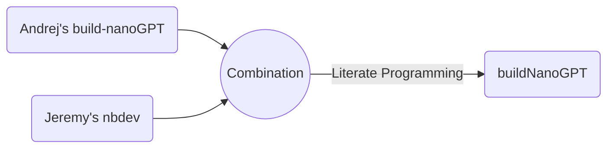

# buildNanoGPT

<!-- WARNING: THIS FILE WAS AUTOGENERATED! DO NOT EDIT! -->

> `buildNanoGPT` is developed based on Andrej Karpathy’s
> [build-nanoGPT](https://github.com/karpathy/build-nanoGPT) repo and
> [Let’s reproduce GPT-2
> (124M)](https://www.youtube.com/watch?v=l8pRSuU81PU) with added notes
> and details for teaching purposes using
> [nbdev](https://nbdev.fast.ai/), which enables package development,
> testing, documentation, and dissemination all in one place - Jupyter
> Notebook or Visual Studio Code Jupyter Notebook in my case 😄.

## Literate Programming

`buildNanoGPT`

`micrograd2023`

## Disclaimers

`buildNanoGPT` is written based on [Andrej
Karpathy’s](https://karpathy.ai/)
[build-nanoGPT](https://github.com/karpathy/makemore) and his [“Neural
Networks: Zero to
Hero”](https://www.youtube.com/playlist?list=PLAqhIrjkxbuWI23v9cThsA9GvCAUhRvKZ)
lecture series. Andrej is the man who needs no introduction in the field
of Deep Learning.

Andrej released a series of lectures called [Neural Network: Zero to
Hero](https://karpathy.ai/zero-to-hero.html), which I found extremely
educational and practical. I am reviewing the lectures and creating
notes for myself and for teaching purposes.

I developed `makemore2023` using [nbdev](https://nbdev.fast.ai/), which
was developed by [Jeremy Howard](https://jeremy.fast.ai/), the man who
also needs no introduction in the field of Deep Learning. Jeremy also
created `fastai` Deep Learning software [library](https://docs.fast.ai/)
and [Courses](https://course.fast.ai/) that are extremely influential. I
highly recommend `fastai` if you are interested in starting your journey
and learning with ML and DL.

`nbdev` is a powerful tool that can be used to efficiently develop,
build, test, document, and distribute software packages all in one
place, Jupyter Notebook or Jupyter Notebooks in VS Code, which I am
using.

If you study lectures by Andrej and Jeremy you will probably notice that
they are both great educators and utilize both top-down and bottom-up
approaches in their teaching, but Andrej predominantly uses *bottom-up*
approach while Jeremy predominantly uses *top-down* one. I personally
fascinated by both educators and found values from both of them and hope
you are too!

## How to install

The [buildNanoGPT](https://pypi.org/project/buildNanoGPT/) package was
uploaded to [PyPI](https://pypi.org/) and can be easily installed using
the below command.

`pip install buildNanoGPT`

### Developer install

If you want to develop `buildNanoGPT` yourself, please use an editable
installation.

`git clone https://github.com/hdocmsu/buildNanoGPT.git`

`pip install -e "buildNanoGPT[dev]"`

You also need to use an editable installation of
[nbdev](https://github.com/fastai/nbdev),
[fastcore](https://github.com/fastai/fastcore), and
[execnb](https://github.com/fastai/execnb).

Happy Coding!!!

<b>Note:</b> `buildNanoGPT` is currently Work in Progress (WIP).

