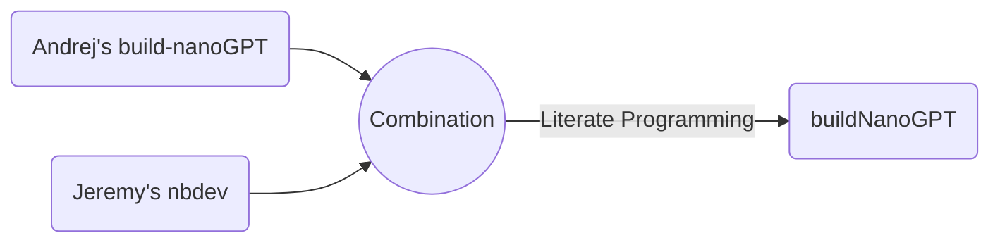

# buildNanoGPT


<!-- WARNING: THIS FILE WAS AUTOGENERATED! DO NOT EDIT! -->

> `buildNanoGPT` is developed based on Andrej Karpathy’s
> [build-nanoGPT](https://github.com/karpathy/build-nanoGPT) repo and
> [Let’s reproduce GPT-2
> (124M)](https://www.youtube.com/watch?v=l8pRSuU81PU) with added notes
> and details for teaching purposes using
> [nbdev](https://nbdev.fast.ai/), which enables package development,
> testing, documentation, and dissemination all in one place - Jupyter
> Notebook or Visual Studio Code Jupyter Notebook in my case 😄.

## Literate Programming

`buildNanoGPT`



`micrograd2023`


## Disclaimers

`buildNanoGPT` is written based on [Andrej
Karpathy’s](https://karpathy.ai/)
[build-nanoGPT](https://github.com/karpathy/makemore) and his [“Neural
Networks: Zero to
Hero”](https://www.youtube.com/playlist?list=PLAqhIrjkxbuWI23v9cThsA9GvCAUhRvKZ)
lecture series. Andrej is the man who needs no introduction in the field
of Deep Learning.

Andrej released a series of lectures called [Neural Network: Zero to
Hero](https://karpathy.ai/zero-to-hero.html), which I found extremely
educational and practical. I am reviewing the lectures and creating
notes for myself and for teaching purposes.

I developed `buildNanoGPT` using [nbdev](https://nbdev.fast.ai/), which
was developed by [Jeremy Howard](https://jeremy.fast.ai/), the man who
also needs no introduction in the field of Deep Learning. Jeremy also
created `fastai` Deep Learning software [library](https://docs.fast.ai/)
and [Courses](https://course.fast.ai/) that are extremely influential. I
highly recommend `fastai` if you are interested in starting your journey
and learning with ML and DL.

`nbdev` is a powerful tool that can be used to efficiently develop,
build, test, document, and distribute software packages all in one
place, Jupyter Notebook or Jupyter Notebooks in VS Code, which I am
using.

If you study lectures by Andrej and Jeremy you will probably notice that
they are both great educators and utilize both top-down and bottom-up
approaches in their teaching, but Andrej predominantly uses *bottom-up*
approach while Jeremy predominantly uses *top-down* one. I personally
fascinated by both educators and found values from both of them and hope
you are too!

## Usage

### Prepare FineWeb-Edu-10B data

``` python
from buildNanoGPT import data
import tiktoken
import numpy as np
```

``` python
enc = tiktoken.get_encoding("gpt2")
eot = enc._special_tokens['<|endoftext|>'] # end of text token
eot
```

    50256

``` python
t_ref = [eot]
t_ref.extend(enc.encode("Hello, world!"))
t_ref = np.array(t_ref).astype(np.uint16)
t_ref
```

    array([50256, 15496,    11,   995,     0], dtype=uint16)

``` python
t_ref = [eot]
t_ref.extend(enc.encode("Hello, world!"))
t_ref = np.array(t_ref).astype(np.int32)
t_ref
```

    array([50256, 15496,    11,   995,     0], dtype=int32)

``` python
doc = {"text":"Hello, world!"}
t_test = data.tokenize(doc)
t_test
```

    array([50256, 15496,    11,   995,     0], dtype=uint16)

``` python
assert np.all(t_ref == t_test)
```

``` python
# Download and Prepare the FineWeb-Edu-10B sample Data
data.edu_fineweb10B_prep(is_test=True)
```

    Resolving data files:   0%|          | 0/1630 [00:00<?, ?it/s]

    Loading dataset shards:   0%|          | 0/98 [00:00<?, ?it/s]

    'Hello from `prepare_edu_fineweb10B()`! if you want to download the dataset, set is_test=False and run again.'

### Prepare HellaSwag Evaluation data

``` python
data.hellaswag_val_prep(is_test=True)
```

    'Hello from `hellaswag_val_prep()`! if you want to download the dataset, set is_test=False and run again.'

### Training

``` python
# either running 03_train.ipynb or short-cut by running train script from the buildNanoGPT package
from buildNanoGPT import train
```

    using device: cuda
    total desired batch size: 524288
    => calculated gradient accumulation steps: 32
    found 99 shards for split train
    found 1 shards for split val
    num decayed parameter tensors: 50, with 124,354,560 parameters
    num non-decayed parameter tensors: 98, with 121,344 parameters
    using fused AdamW: True
    validation loss: 10.9834
    HellaSwag accuracy: 2534/10042=0.2523
    step     0 | loss: 10.981724 | lr 6.0000e-06 | norm: 15.4339 | dt: 83309.97ms | tok/sec: 6293.22
    step     1 | loss: 10.655204 | lr 1.2000e-05 | norm: 12.4932 | dt: 10441.83ms | tok/sec: 50210.33
    step     2 | loss: 10.274609 | lr 1.8000e-05 | norm: 7.7501 | dt: 10703.46ms | tok/sec: 48983.03
    step     3 | loss: 10.004147 | lr 2.4000e-05 | norm: 5.2698 | dt: 10656.07ms | tok/sec: 49200.86
    step     4 | loss: 9.833078 | lr 3.0000e-05 | norm: 3.6179 | dt: 10590.84ms | tok/sec: 49503.89
    step     5 | loss: 9.711226 | lr 3.6000e-05 | norm: 2.7871 | dt: 10506.99ms | tok/sec: 49898.96
    step     6 | loss: 9.642424 | lr 4.2000e-05 | norm: 2.4048 | dt: 10580.03ms | tok/sec: 49554.47
    step     7 | loss: 9.612314 | lr 4.8000e-05 | norm: 2.3183 | dt: 10760.23ms | tok/sec: 48724.63
    step     8 | loss: 9.558193 | lr 5.4000e-05 | norm: 2.2465 | dt: 10547.01ms | tok/sec: 49709.65
    step     9 | loss: 9.526470 | lr 6.0000e-05 | norm: 2.2171 | dt: 10849.35ms | tok/sec: 48324.35
    step    10 | loss: 9.463452 | lr 6.6000e-05 | norm: 2.1546 | dt: 10825.20ms | tok/sec: 48432.18
    step    11 | loss: 9.413274 | lr 7.2000e-05 | norm: 2.1401 | dt: 10498.90ms | tok/sec: 49937.42
    step    12 | loss: 9.340550 | lr 7.8000e-05 | norm: 2.0149 | dt: 10571.82ms | tok/sec: 49592.97
    step    13 | loss: 9.278627 | lr 8.4000e-05 | norm: 1.9368 | dt: 10509.50ms | tok/sec: 49887.06

### Visualize the Log

``` python
from buildNanoGPT.train import plot_log
```

## How to install

The [buildNanoGPT](https://pypi.org/project/buildNanoGPT/) package was
uploaded to [PyPI](https://pypi.org/) and can be easily installed using
the below command.

`pip install buildNanoGPT`

### Developer install

If you want to develop `buildNanoGPT` yourself, please use an editable
installation.

`git clone https://github.com/hdocmsu/buildNanoGPT.git`

`pip install -e "buildNanoGPT[dev]"`

You also need to use an editable installation of
[nbdev](https://github.com/fastai/nbdev),
[fastcore](https://github.com/fastai/fastcore), and
[execnb](https://github.com/fastai/execnb).

Happy Coding!!!

<div class="alert alert-info">

<b>Note:</b> `buildNanoGPT` is currently Work in Progress (WIP).

</div>
