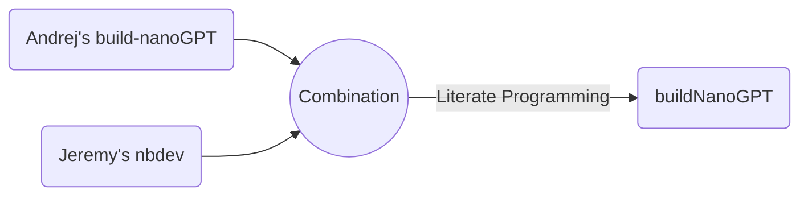

# buildNanoGPT


<!-- WARNING: THIS FILE WAS AUTOGENERATED! DO NOT EDIT! -->

> `buildNanoGPT` is developed based on Andrej Karpathy’s
> [build-nanoGPT](https://github.com/karpathy/build-nanoGPT) repo and
> [Let’s reproduce GPT-2
> (124M)](https://www.youtube.com/watch?v=l8pRSuU81PU) with added notes
> and details for teaching purposes using
> [nbdev](https://nbdev.fast.ai/), which enables package development,
> testing, documentation, and dissemination all in one place - Jupyter
> Notebook or Visual Studio Code Jupyter Notebook in my case 😄.

## Literate Programming

`buildNanoGPT`



`micrograd2023`


## Disclaimers

`buildNanoGPT` is written based on [Andrej
Karpathy](https://karpathy.ai/)’s github repo named
[build-nanoGPT](https://github.com/karpathy/makemore) and his [“Neural
Networks: Zero to
Hero”](https://www.youtube.com/playlist?list=PLAqhIrjkxbuWI23v9cThsA9GvCAUhRvKZ)
lecture series. Specifically the lecture called [Let’s reproduce GPT-2
(124M)](https://www.youtube.com/watch?v=l8pRSuU81PU).

Andrej is the man who needs no introduction in the field of Deep
Learning. He released a series of lectures called [Neural Network: Zero
to Hero](https://karpathy.ai/zero-to-hero.html), which I found extremely
educational and practical. I am reviewing the lectures and creating
notes for myself and for teaching purposes.

`buildNanoGPT` was written using [nbdev](https://nbdev.fast.ai/), which
was developed by [Jeremy Howard](https://jeremy.fast.ai/), the man who
also needs no introduction in the field of Deep Learning. Jeremy created
`fastai` Deep Learning software [library](https://docs.fast.ai/) and
[Courses](https://course.fast.ai/) that are extremely influential. I
highly recommend `fastai` if you are interested in starting your journey
and learning with ML and DL.

`nbdev` is a powerful tool that can be used to efficiently develop,
build, test, document, and distribute software packages all in one
place, Jupyter Notebook or Jupyter Notebooks in VS Code, which I am
using.

If you study lectures by Andrej and Jeremy you will probably notice that
they are both great educators and utilize both top-down and bottom-up
approaches in their teaching, but Andrej predominantly uses *bottom-up*
approach while Jeremy predominantly uses *top-down* one. I personally
fascinated by both educators and found values from both of them and hope
you are too!

## Usage

### Prepare FineWeb-Edu-10B data

``` python
from buildNanoGPT import data
import tiktoken
import numpy as np
```

``` python
enc = tiktoken.get_encoding("gpt2")
eot = enc._special_tokens['<|endoftext|>'] # end of text token
eot
```

    50256

``` python
t_ref = [eot]
t_ref.extend(enc.encode("Hello, world!"))
t_ref = np.array(t_ref).astype(np.uint16)
t_ref
```

    array([50256, 15496,    11,   995,     0], dtype=uint16)

``` python
t_ref = [eot]
t_ref.extend(enc.encode("Hello, world!"))
t_ref = np.array(t_ref).astype(np.int32)
t_ref
```

    array([50256, 15496,    11,   995,     0], dtype=int32)

``` python
doc = {"text":"Hello, world!"}
t_test = data.tokenize(doc)
t_test
```

    array([50256, 15496,    11,   995,     0], dtype=uint16)

``` python
assert np.all(t_ref == t_test)
```

``` python
# Download and Prepare the FineWeb-Edu-10B sample Data
data.edu_fineweb10B_prep(is_test=True)
```

    Resolving data files:   0%|          | 0/1630 [00:00<?, ?it/s]

    Loading dataset shards:   0%|          | 0/98 [00:00<?, ?it/s]

    'Hello from `prepare_edu_fineweb10B()`! if you want to download the dataset, set is_test=False and run again.'

### Prepare HellaSwag Evaluation data

``` python
data.hellaswag_val_prep(is_test=True)
```

    'Hello from `hellaswag_val_prep()`! if you want to download the dataset, set is_test=False and run again.'

### Load Pre-trained Weight

``` python
def generate_text(model, enc, device, device_type, ddp_rank):
    """generate some text from the model, using top-k sampling."""
    model.eval()
    num_return_sequences = 4
    max_length = 32
    tokens = enc.encode("Hello, I'm a language model,")
    tokens = torch.tensor(tokens, dtype=torch.long)
    tokens = tokens.unsqueeze(0).repeat(num_return_sequences, 1)
    xgen = tokens.to(device)
    sample_rng = torch.Generator(device=device)
    sample_rng.manual_seed(42 + ddp_rank)
    while xgen.size(1) < max_length:
        # forward the model to get the logits
        with torch.no_grad():
            # logits, loss = model(xgen) # (B, T, vocab_size)
            with torch.autocast(device_type=device_type, dtype=torch.bfloat16):
                logits, loss = model(xgen) # (B, T, vocab_size)
            # take the logits at the last position
            logits = logits[:, -1, :] # (B, vocab_size)
            # get the probabilities
            probs = F.softmax(logits, dim=-1)
            # do top-k sampling of 50 (huggingface pipeline default)
            # topk_probs here becomes (5, 50), topk_indices is (5, 50)
            topk_probs, topk_indices = torch.topk(probs, 50, dim=-1)
            # select a token from the top-k probabilities
            # note: multinomial does not demand the input to sum to 1
            ix = torch.multinomial(topk_probs, 1, generator=sample_rng) # (B, 1)
            # gather the corresponding indices
            xcol = torch.gather(topk_indices, -1, ix) # (B, 1)
            # append to the sequence
            xgen = torch.cat((xgen, xcol), dim=1)
    # print the generated text
    for i in range(num_return_sequences):
        tokens = xgen[i, :max_length].tolist()
        decoded = enc.decode(tokens)
        print(f"rank {ddp_rank} sample {i}: {decoded}")
```

``` python
from buildNanoGPT.model import GPT, GPTConfig
import tiktoken
import torch
from torch.nn import functional as F
```

``` python
master_process = True
model = GPT.from_pretrained("gpt2", master_process)
```

    loading weights from pretrained gpt: gpt2

``` python
enc = tiktoken.get_encoding('gpt2')
```

``` python
generate_text(model, enc, 'cpu', 'cpu', 0)
```

    rank 0 sample 0: Hello, I'm a language model, and the language theory behind the language theorem is a bit about programming languages. We are interested in that and so I found
    rank 0 sample 1: Hello, I'm a language model, a real-world application of software engineering. I think, I don't want to be able to talk about it because
    rank 0 sample 2: Hello, I'm a language model, not a programming model. Just as a new piece of machinery would be built into our economy, the machine that would create
    rank 0 sample 3: Hello, I'm a language model, what could I write from scratch?

    The first major question is how to model, process, write, and test

### Training

``` python
# either running 03_train.ipynb or short-cut by running train script from the buildNanoGPT package
from buildNanoGPT import train
```

    using device: cuda
    total desired batch size: 524288
    => calculated gradient accumulation steps: 32
    found 99 shards for split train
    found 1 shards for split val
    num decayed parameter tensors: 50, with 124,354,560 parameters
    num non-decayed parameter tensors: 98, with 121,344 parameters
    using fused AdamW: True
    validation loss: 10.9834
    HellaSwag accuracy: 2534/10042=0.2523
    step     0 | loss: 10.981724 | lr 6.0000e-06 | norm: 15.4339 | dt: 82809.98ms | tok/sec: 6331.22
    step     1 | loss: 10.655205 | lr 1.2000e-05 | norm: 12.4931 | dt: 10492.83ms | tok/sec: 49966.29
    step     2 | loss: 10.274603 | lr 1.8000e-05 | norm: 7.7501 | dt: 10522.88ms | tok/sec: 49823.61
    step     3 | loss: 10.004156 | lr 2.4000e-05 | norm: 5.2698 | dt: 10481.91ms | tok/sec: 50018.35
    step     4 | loss: 9.833108 | lr 3.0000e-05 | norm: 3.6179 | dt: 10495.18ms | tok/sec: 49955.14
    step     5 | loss: 9.711222 | lr 3.6000e-05 | norm: 2.7871 | dt: 10484.25ms | tok/sec: 50007.21
    step     6 | loss: 9.642426 | lr 4.2000e-05 | norm: 2.4048 | dt: 10679.06ms | tok/sec: 49094.97
    step     7 | loss: 9.612312 | lr 4.8000e-05 | norm: 2.3183 | dt: 10555.78ms | tok/sec: 49668.32
    step     8 | loss: 9.558184 | lr 5.4000e-05 | norm: 2.2464 | dt: 10685.39ms | tok/sec: 49065.86
    step     9 | loss: 9.526472 | lr 6.0000e-05 | norm: 2.2171 | dt: 10548.39ms | tok/sec: 49703.14
    step    10 | loss: 9.463450 | lr 6.6000e-05 | norm: 2.1546 | dt: 10559.73ms | tok/sec: 49649.78
    step    11 | loss: 9.413282 | lr 7.2000e-05 | norm: 2.1401 | dt: 10495.94ms | tok/sec: 49951.49
    step    12 | loss: 9.340552 | lr 7.8000e-05 | norm: 2.0149 | dt: 10668.78ms | tok/sec: 49142.26
    step    13 | loss: 9.278631 | lr 8.4000e-05 | norm: 1.9368 | dt: 10605.16ms | tok/sec: 49437.05
    step    14 | loss: 9.159446 | lr 9.0000e-05 | norm: 1.9737 | dt: 10701.77ms | tok/sec: 48990.76
    step    15 | loss: 9.111786 | lr 9.6000e-05 | norm: 3.0525 | dt: 10732.83ms | tok/sec: 48849.00
    step    16 | loss: 9.029915 | lr 1.0200e-04 | norm: 1.9619 | dt: 10790.65ms | tok/sec: 48587.23
    step    17 | loss: 8.937255 | lr 1.0800e-04 | norm: 1.8786 | dt: 10621.46ms | tok/sec: 49361.22
    step    18 | loss: 8.955976 | lr 1.1400e-04 | norm: 2.0179 | dt: 10545.33ms | tok/sec: 49717.53
    step    19 | loss: 8.888343 | lr 1.2000e-04 | norm: 1.9142 | dt: 10598.08ms | tok/sec: 49470.11
    step    20 | loss: 8.672051 | lr 1.2600e-04 | norm: 1.7543 | dt: 10730.04ms | tok/sec: 48861.68
    step    21 | loss: 8.556496 | lr 1.3200e-04 | norm: 1.6246 | dt: 10822.08ms | tok/sec: 48446.13
    step    22 | loss: 8.463942 | lr 1.3800e-04 | norm: 1.4898 | dt: 10733.11ms | tok/sec: 48847.72
    step    23 | loss: 8.389053 | lr 1.4400e-04 | norm: 1.9412 | dt: 10555.51ms | tok/sec: 49669.61
    step    24 | loss: 8.257857 | lr 1.5000e-04 | norm: 2.0539 | dt: 10732.67ms | tok/sec: 48849.75
    step    25 | loss: 8.128786 | lr 1.5600e-04 | norm: 1.4269 | dt: 10609.93ms | tok/sec: 49414.84
    step    26 | loss: 8.098352 | lr 1.6200e-04 | norm: 2.0206 | dt: 10487.59ms | tok/sec: 49991.30
    step    27 | loss: 7.961097 | lr 1.6800e-04 | norm: 1.2978 | dt: 10578.22ms | tok/sec: 49562.95
    step    28 | loss: 7.884172 | lr 1.7400e-04 | norm: 1.2289 | dt: 10497.51ms | tok/sec: 49944.04
    step    29 | loss: 7.765845 | lr 1.8000e-04 | norm: 1.1969 | dt: 10724.78ms | tok/sec: 48885.65
    step    30 | loss: 7.821087 | lr 1.8600e-04 | norm: 1.0228 | dt: 10792.80ms | tok/sec: 48577.58
    step    31 | loss: 7.689835 | lr 1.9200e-04 | norm: 0.9216 | dt: 10752.80ms | tok/sec: 48758.30
    step    32 | loss: 7.641486 | lr 1.9800e-04 | norm: 0.8666 | dt: 10985.01ms | tok/sec: 47727.58
    step    33 | loss: 7.572504 | lr 2.0400e-04 | norm: 0.7996 | dt: 10684.39ms | tok/sec: 49070.46
    step    34 | loss: 7.429519 | lr 2.1000e-04 | norm: 0.7874 | dt: 10696.01ms | tok/sec: 49017.15
    step    35 | loss: 7.414855 | lr 2.1600e-04 | norm: 0.7272 | dt: 10580.76ms | tok/sec: 49551.08
    step    36 | loss: 7.393157 | lr 2.2200e-04 | norm: 0.8536 | dt: 10748.95ms | tok/sec: 48775.74
    step    37 | loss: 7.287198 | lr 2.2800e-04 | norm: 0.5487 | dt: 10921.08ms | tok/sec: 48006.98
    step    38 | loss: 7.252760 | lr 2.3400e-04 | norm: 0.4738 | dt: 10716.44ms | tok/sec: 48923.69
    step    39 | loss: 7.292991 | lr 2.4000e-04 | norm: 0.5769 | dt: 10659.42ms | tok/sec: 49185.43
    step    40 | loss: 7.251584 | lr 2.4600e-04 | norm: 0.9509 | dt: 10570.06ms | tok/sec: 49601.22
    step    41 | loss: 7.209351 | lr 2.5200e-04 | norm: 1.7773 | dt: 10611.45ms | tok/sec: 49407.78
    step    42 | loss: 7.140303 | lr 2.5800e-04 | norm: 0.9441 | dt: 10753.44ms | tok/sec: 48755.36
    step    43 | loss: 7.216593 | lr 2.6400e-04 | norm: 2.1513 | dt: 10632.68ms | tok/sec: 49309.09
    step    44 | loss: 7.155683 | lr 2.7000e-04 | norm: 1.3599 | dt: 10780.88ms | tok/sec: 48631.27
    step    45 | loss: 7.159153 | lr 2.7600e-04 | norm: 1.1990 | dt: 10722.27ms | tok/sec: 48897.11
    step    46 | loss: 7.126624 | lr 2.8200e-04 | norm: 0.8272 | dt: 10791.48ms | tok/sec: 48583.50
    step    47 | loss: 7.190242 | lr 2.8800e-04 | norm: 0.9578 | dt: 10718.49ms | tok/sec: 48914.35
    step    48 | loss: 7.194102 | lr 2.9400e-04 | norm: 0.7273 | dt: 10651.67ms | tok/sec: 49221.22
    step    49 | loss: 7.113352 | lr 3.0000e-04 | norm: 1.1239 | dt: 10732.94ms | tok/sec: 48848.51
    step    50 | loss: 7.169769 | lr 3.0600e-04 | norm: 1.0528 | dt: 10706.81ms | tok/sec: 48967.72
    step    51 | loss: 7.103631 | lr 3.1200e-04 | norm: 1.0537 | dt: 10826.62ms | tok/sec: 48425.82
    step    52 | loss: 7.092214 | lr 3.1800e-04 | norm: 0.7355 | dt: 10777.80ms | tok/sec: 48645.18
    step    53 | loss: 7.021073 | lr 3.2400e-04 | norm: 0.8493 | dt: 10907.12ms | tok/sec: 48068.41
    step    54 | loss: 7.030515 | lr 3.3000e-04 | norm: 0.7924 | dt: 10822.94ms | tok/sec: 48442.27
    step    55 | loss: 7.027347 | lr 3.3600e-04 | norm: 0.8563 | dt: 10661.62ms | tok/sec: 49175.26
    step    56 | loss: 7.007086 | lr 3.4200e-04 | norm: 1.2067 | dt: 10764.39ms | tok/sec: 48705.77
    step    57 | loss: 6.978011 | lr 3.4800e-04 | norm: 0.5606 | dt: 10967.17ms | tok/sec: 47805.22
    step    58 | loss: 6.919628 | lr 3.5400e-04 | norm: 1.3408 | dt: 10802.21ms | tok/sec: 48535.23
    step    59 | loss: 6.887385 | lr 3.6000e-04 | norm: 1.3971 | dt: 10907.45ms | tok/sec: 48066.97
    step    60 | loss: 6.879627 | lr 3.6600e-04 | norm: 0.7581 | dt: 10768.36ms | tok/sec: 48687.80
    step    61 | loss: 6.906055 | lr 3.7200e-04 | norm: 0.9657 | dt: 10613.11ms | tok/sec: 49400.03
    step    62 | loss: 6.795964 | lr 3.7800e-04 | norm: 0.6819 | dt: 10593.62ms | tok/sec: 49490.92
    step    63 | loss: 6.780255 | lr 3.8400e-04 | norm: 0.7485 | dt: 10719.51ms | tok/sec: 48909.68
    step    64 | loss: 6.767306 | lr 3.9000e-04 | norm: 0.7399 | dt: 10806.62ms | tok/sec: 48515.44
    step    65 | loss: 6.801779 | lr 3.9600e-04 | norm: 0.7439 | dt: 10609.56ms | tok/sec: 49416.58
    step    66 | loss: 6.721136 | lr 4.0200e-04 | norm: 0.5727 | dt: 10749.83ms | tok/sec: 48771.73
    step    67 | loss: 6.750595 | lr 4.0800e-04 | norm: 0.7310 | dt: 10711.53ms | tok/sec: 48946.13
    step    68 | loss: 6.730660 | lr 4.1400e-04 | norm: 0.5052 | dt: 10772.71ms | tok/sec: 48668.16
    step    69 | loss: 6.631037 | lr 4.2000e-04 | norm: 0.6577 | dt: 10736.56ms | tok/sec: 48832.04
    step    70 | loss: 6.612390 | lr 4.2600e-04 | norm: 0.6208 | dt: 10598.25ms | tok/sec: 49469.31
    step    71 | loss: 6.643014 | lr 4.3200e-04 | norm: 0.6751 | dt: 10712.97ms | tok/sec: 48939.57
    step    72 | loss: 6.602534 | lr 4.3800e-04 | norm: 0.8274 | dt: 10685.25ms | tok/sec: 49066.50
    step    73 | loss: 6.606695 | lr 4.4400e-04 | norm: 1.0497 | dt: 10784.33ms | tok/sec: 48615.72
    step    74 | loss: 6.532132 | lr 4.5000e-04 | norm: 0.9483 | dt: 11051.53ms | tok/sec: 47440.31
    step    75 | loss: 6.571723 | lr 4.5600e-04 | norm: 0.5493 | dt: 10943.98ms | tok/sec: 47906.50
    step    76 | loss: 6.519442 | lr 4.6200e-04 | norm: 0.6364 | dt: 11138.90ms | tok/sec: 47068.20
    step    77 | loss: 6.553431 | lr 4.6800e-04 | norm: 0.6423 | dt: 10943.91ms | tok/sec: 47906.81
    step    78 | loss: 6.525961 | lr 4.7400e-04 | norm: 0.4541 | dt: 10733.66ms | tok/sec: 48845.21
    step    79 | loss: 6.474160 | lr 4.8000e-04 | norm: 0.6690 | dt: 10748.03ms | tok/sec: 48779.93
    step    80 | loss: 6.481711 | lr 4.8600e-04 | norm: 0.5859 | dt: 10679.49ms | tok/sec: 49093.00
    step    81 | loss: 6.486966 | lr 4.9200e-04 | norm: 0.6897 | dt: 10656.78ms | tok/sec: 49197.58
    step    82 | loss: 6.430150 | lr 4.9800e-04 | norm: 0.6284 | dt: 10426.83ms | tok/sec: 50282.59
    step    83 | loss: 6.387268 | lr 5.0400e-04 | norm: 0.5746 | dt: 10644.15ms | tok/sec: 49255.97
    step    84 | loss: 6.405340 | lr 5.1000e-04 | norm: 0.5523 | dt: 10856.28ms | tok/sec: 48293.53
    step    85 | loss: 6.371199 | lr 5.1600e-04 | norm: 0.6764 | dt: 10573.15ms | tok/sec: 49586.76
    step    86 | loss: 6.367082 | lr 5.2200e-04 | norm: 0.7355 | dt: 10731.52ms | tok/sec: 48854.94
    step    87 | loss: 6.404164 | lr 5.2800e-04 | norm: 0.7907 | dt: 10878.82ms | tok/sec: 48193.45
    step    88 | loss: 6.383866 | lr 5.3400e-04 | norm: 0.7472 | dt: 10855.23ms | tok/sec: 48298.20
    step    89 | loss: 6.428278 | lr 5.4000e-04 | norm: 0.7306 | dt: 10751.87ms | tok/sec: 48762.51
    step    90 | loss: 6.355624 | lr 5.4600e-04 | norm: 0.6458 | dt: 10799.97ms | tok/sec: 48545.31
    step    91 | loss: 6.356147 | lr 5.5200e-04 | norm: 0.5809 | dt: 10756.22ms | tok/sec: 48742.76
    step    92 | loss: 6.407714 | lr 5.5800e-04 | norm: 0.5222 | dt: 10799.32ms | tok/sec: 48548.25
    step    93 | loss: 6.488331 | lr 5.6400e-04 | norm: 0.8362 | dt: 10773.78ms | tok/sec: 48663.34
    step    94 | loss: 6.541770 | lr 5.7000e-04 | norm: 1.7085 | dt: 10864.89ms | tok/sec: 48255.23
    step    95 | loss: 6.541307 | lr 5.7600e-04 | norm: 1.3723 | dt: 10788.27ms | tok/sec: 48597.98
    step    96 | loss: 6.460635 | lr 5.8200e-04 | norm: 0.7749 | dt: 10840.03ms | tok/sec: 48365.92
    step    97 | loss: 6.439204 | lr 5.8800e-04 | norm: 1.0601 | dt: 10847.54ms | tok/sec: 48332.45
    step    98 | loss: 6.489636 | lr 5.9400e-04 | norm: 1.1039 | dt: 10751.69ms | tok/sec: 48763.31
    step    99 | loss: 6.463543 | lr 6.0000e-04 | norm: 1.1220 | dt: 11026.37ms | tok/sec: 47548.54
    step   100 | loss: 6.475557 | lr 6.0000e-04 | norm: 0.8641 | dt: 10706.05ms | tok/sec: 48971.19
    step   101 | loss: 6.403978 | lr 5.9987e-04 | norm: 0.6312 | dt: 10799.40ms | tok/sec: 48547.87
    step   102 | loss: 6.399425 | lr 5.9947e-04 | norm: 0.9644 | dt: 10571.53ms | tok/sec: 49594.33
    step   103 | loss: 6.291117 | lr 5.9880e-04 | norm: 0.8341 | dt: 10589.38ms | tok/sec: 49510.71
    step   104 | loss: 6.395230 | lr 5.9787e-04 | norm: 0.6783 | dt: 10603.40ms | tok/sec: 49445.27
    step   105 | loss: 6.381511 | lr 5.9668e-04 | norm: 0.5386 | dt: 10608.30ms | tok/sec: 49422.43
    step   106 | loss: 6.345720 | lr 5.9522e-04 | norm: 0.4796 | dt: 10714.76ms | tok/sec: 48931.39
    step   107 | loss: 6.295020 | lr 5.9350e-04 | norm: 0.5316 | dt: 10712.39ms | tok/sec: 48942.19
    step   108 | loss: 6.354154 | lr 5.9152e-04 | norm: 0.4104 | dt: 10863.69ms | tok/sec: 48260.57
    step   109 | loss: 6.346787 | lr 5.8928e-04 | norm: 0.5001 | dt: 10882.25ms | tok/sec: 48178.25
    step   110 | loss: 6.309251 | lr 5.8679e-04 | norm: 0.4883 | dt: 10608.02ms | tok/sec: 49423.72
    step   111 | loss: 6.281376 | lr 5.8404e-04 | norm: 0.5975 | dt: 10248.73ms | tok/sec: 51156.40
    step   112 | loss: 6.262320 | lr 5.8104e-04 | norm: 0.4393 | dt: 9123.81ms | tok/sec: 57463.69
    step   113 | loss: 6.289036 | lr 5.7779e-04 | norm: 0.4367 | dt: 9033.14ms | tok/sec: 58040.48
    step   114 | loss: 6.315429 | lr 5.7430e-04 | norm: 0.5169 | dt: 9021.78ms | tok/sec: 58113.61
    step   115 | loss: 6.286012 | lr 5.7057e-04 | norm: 0.5163 | dt: 9020.69ms | tok/sec: 58120.62
    step   116 | loss: 6.218066 | lr 5.6660e-04 | norm: 0.4813 | dt: 9021.61ms | tok/sec: 58114.68
    step   117 | loss: 6.163318 | lr 5.6240e-04 | norm: 0.5648 | dt: 9018.39ms | tok/sec: 58135.44
    step   118 | loss: 6.194816 | lr 5.5797e-04 | norm: 0.7243 | dt: 9019.76ms | tok/sec: 58126.63
    step   119 | loss: 6.205301 | lr 5.5331e-04 | norm: 0.5606 | dt: 9019.06ms | tok/sec: 58131.12
    step   120 | loss: 6.187188 | lr 5.4843e-04 | norm: 0.5205 | dt: 9021.12ms | tok/sec: 58117.87
    step   121 | loss: 6.149425 | lr 5.4334e-04 | norm: 0.5132 | dt: 9019.32ms | tok/sec: 58129.44
    step   122 | loss: 6.156881 | lr 5.3804e-04 | norm: 0.4721 | dt: 9030.19ms | tok/sec: 58059.47
    step   123 | loss: 6.160114 | lr 5.3253e-04 | norm: 0.5163 | dt: 9019.01ms | tok/sec: 58131.42
    step   124 | loss: 6.161614 | lr 5.2682e-04 | norm: 0.3730 | dt: 9021.48ms | tok/sec: 58115.54
    step   125 | loss: 6.162668 | lr 5.2092e-04 | norm: 0.4222 | dt: 9022.97ms | tok/sec: 58105.90
    step   126 | loss: 6.142958 | lr 5.1483e-04 | norm: 0.3661 | dt: 9025.08ms | tok/sec: 58092.34
    step   127 | loss: 6.107336 | lr 5.0855e-04 | norm: 0.3189 | dt: 9022.45ms | tok/sec: 58109.29
    step   128 | loss: 6.059753 | lr 5.0210e-04 | norm: 0.3107 | dt: 9017.19ms | tok/sec: 58143.18
    step   129 | loss: 6.064310 | lr 4.9548e-04 | norm: 0.3808 | dt: 9027.10ms | tok/sec: 58079.35
    step   130 | loss: 6.106601 | lr 4.8870e-04 | norm: 0.3701 | dt: 9025.69ms | tok/sec: 58088.43
    step   131 | loss: 6.069602 | lr 4.8176e-04 | norm: 0.3277 | dt: 9014.09ms | tok/sec: 58163.13
    step   132 | loss: 6.078692 | lr 4.7467e-04 | norm: 0.3552 | dt: 9023.25ms | tok/sec: 58104.11
    step   133 | loss: 5.993310 | lr 4.6744e-04 | norm: 0.4006 | dt: 9025.95ms | tok/sec: 58086.72
    step   134 | loss: 6.013237 | lr 4.6007e-04 | norm: 0.4799 | dt: 9018.29ms | tok/sec: 58136.08
    step   135 | loss: 6.053710 | lr 4.5258e-04 | norm: 0.4524 | dt: 9032.08ms | tok/sec: 58047.32
    step   136 | loss: 6.033798 | lr 4.4496e-04 | norm: 0.3394 | dt: 9026.17ms | tok/sec: 58085.34
    step   137 | loss: 6.055409 | lr 4.3723e-04 | norm: 0.3845 | dt: 9021.99ms | tok/sec: 58112.23
    step   138 | loss: 6.007836 | lr 4.2939e-04 | norm: 0.4304 | dt: 9036.39ms | tok/sec: 58019.64
    step   139 | loss: 6.109036 | lr 4.2146e-04 | norm: 0.3833 | dt: 9019.26ms | tok/sec: 58129.83
    step   140 | loss: 6.218612 | lr 4.1343e-04 | norm: 0.3712 | dt: 9023.31ms | tok/sec: 58103.75
    step   141 | loss: 6.109329 | lr 4.0533e-04 | norm: 0.3751 | dt: 9032.97ms | tok/sec: 58041.61
    step   142 | loss: 6.157863 | lr 3.9715e-04 | norm: 0.3973 | dt: 9026.04ms | tok/sec: 58086.18
    step   143 | loss: 6.105368 | lr 3.8890e-04 | norm: 0.4718 | dt: 9024.10ms | tok/sec: 58098.66
    step   144 | loss: 6.112780 | lr 3.8059e-04 | norm: 0.5495 | dt: 9024.62ms | tok/sec: 58095.32
    step   145 | loss: 6.094649 | lr 3.7224e-04 | norm: 0.4203 | dt: 9219.34ms | tok/sec: 56868.26
    step   146 | loss: 6.120586 | lr 3.6384e-04 | norm: 0.3370 | dt: 9118.57ms | tok/sec: 57496.73
    step   147 | loss: 6.128690 | lr 3.5541e-04 | norm: 0.3505 | dt: 9019.72ms | tok/sec: 58126.89
    step   148 | loss: 6.126965 | lr 3.4695e-04 | norm: 0.3768 | dt: 9027.35ms | tok/sec: 58077.76
    step   149 | loss: 6.087430 | lr 3.3848e-04 | norm: 0.2887 | dt: 9014.19ms | tok/sec: 58162.52
    step   150 | loss: 6.099020 | lr 3.3000e-04 | norm: 0.3975 | dt: 9018.30ms | tok/sec: 58135.99
    step   151 | loss: 6.011409 | lr 3.2152e-04 | norm: 0.3445 | dt: 9018.43ms | tok/sec: 58135.15
    step   152 | loss: 6.053518 | lr 3.1305e-04 | norm: 0.2765 | dt: 9021.84ms | tok/sec: 58113.21
    step   153 | loss: 6.096207 | lr 3.0459e-04 | norm: 0.3268 | dt: 9022.89ms | tok/sec: 58106.44
    step   154 | loss: 6.014778 | lr 2.9616e-04 | norm: 0.4205 | dt: 9023.55ms | tok/sec: 58102.17
    step   155 | loss: 5.993350 | lr 2.8776e-04 | norm: 0.2954 | dt: 9016.75ms | tok/sec: 58146.04
    step   156 | loss: 6.027627 | lr 2.7941e-04 | norm: 0.3306 | dt: 9031.58ms | tok/sec: 58050.53
    step   157 | loss: 6.092584 | lr 2.7110e-04 | norm: 0.3101 | dt: 9025.19ms | tok/sec: 58091.62
    step   158 | loss: 6.105118 | lr 2.6285e-04 | norm: 0.2992 | dt: 9019.38ms | tok/sec: 58129.02
    step   159 | loss: 6.017125 | lr 2.5467e-04 | norm: 0.3080 | dt: 9016.80ms | tok/sec: 58145.71
    step   160 | loss: 5.959670 | lr 2.4657e-04 | norm: 0.2711 | dt: 9024.38ms | tok/sec: 58096.83
    step   161 | loss: 6.058784 | lr 2.3854e-04 | norm: 0.2906 | dt: 9024.04ms | tok/sec: 58099.06
    step   162 | loss: 5.958908 | lr 2.3061e-04 | norm: 0.2375 | dt: 9025.14ms | tok/sec: 58091.94
    step   163 | loss: 5.928731 | lr 2.2277e-04 | norm: 0.3086 | dt: 9024.43ms | tok/sec: 58096.51
    step   164 | loss: 5.932847 | lr 2.1504e-04 | norm: 0.2456 | dt: 9031.44ms | tok/sec: 58051.43
    step   165 | loss: 5.987537 | lr 2.0742e-04 | norm: 0.3180 | dt: 9034.98ms | tok/sec: 58028.72
    step   166 | loss: 5.846995 | lr 1.9993e-04 | norm: 0.3659 | dt: 9028.83ms | tok/sec: 58068.20
    step   167 | loss: 5.949950 | lr 1.9256e-04 | norm: 0.3790 | dt: 9024.60ms | tok/sec: 58095.40
    step   168 | loss: 5.925792 | lr 1.8533e-04 | norm: 0.2998 | dt: 9023.44ms | tok/sec: 58102.89
    step   169 | loss: 5.927565 | lr 1.7824e-04 | norm: 0.3140 | dt: 9021.85ms | tok/sec: 58113.12
    step   170 | loss: 5.913670 | lr 1.7130e-04 | norm: 0.3304 | dt: 9031.75ms | tok/sec: 58049.43
    step   171 | loss: 5.944331 | lr 1.6452e-04 | norm: 0.2440 | dt: 9029.87ms | tok/sec: 58061.54
    step   172 | loss: 5.913747 | lr 1.5790e-04 | norm: 0.3646 | dt: 9022.08ms | tok/sec: 58111.66
    step   173 | loss: 5.894815 | lr 1.5145e-04 | norm: 0.2861 | dt: 9027.03ms | tok/sec: 58079.77
    step   174 | loss: 5.846126 | lr 1.4517e-04 | norm: 0.2546 | dt: 9021.01ms | tok/sec: 58118.55
    step   175 | loss: 5.903183 | lr 1.3908e-04 | norm: 0.2809 | dt: 9023.06ms | tok/sec: 58105.36
    step   176 | loss: 5.857369 | lr 1.3318e-04 | norm: 0.2143 | dt: 9018.74ms | tok/sec: 58133.16
    step   177 | loss: 5.902529 | lr 1.2747e-04 | norm: 0.2514 | dt: 9017.04ms | tok/sec: 58144.11
    step   178 | loss: 5.833840 | lr 1.2196e-04 | norm: 0.2743 | dt: 9027.74ms | tok/sec: 58075.25
    step   179 | loss: 5.825159 | lr 1.1666e-04 | norm: 0.2201 | dt: 9018.76ms | tok/sec: 58133.05
    step   180 | loss: 5.823802 | lr 1.1157e-04 | norm: 0.2582 | dt: 9026.48ms | tok/sec: 58083.35
    step   181 | loss: 5.850857 | lr 1.0669e-04 | norm: 0.2286 | dt: 9032.15ms | tok/sec: 58046.85
    step   182 | loss: 5.852230 | lr 1.0203e-04 | norm: 0.2073 | dt: 9025.26ms | tok/sec: 58091.20
    step   183 | loss: 5.848113 | lr 9.7600e-05 | norm: 0.2366 | dt: 9030.65ms | tok/sec: 58056.49
    step   184 | loss: 5.875956 | lr 9.3397e-05 | norm: 0.2153 | dt: 9036.46ms | tok/sec: 58019.15
    step   185 | loss: 5.925734 | lr 8.9428e-05 | norm: 0.2497 | dt: 9028.40ms | tok/sec: 58070.95
    step   186 | loss: 5.951926 | lr 8.5697e-05 | norm: 0.2276 | dt: 9026.99ms | tok/sec: 58080.07
    step   187 | loss: 6.008245 | lr 8.2206e-05 | norm: 0.2261 | dt: 9028.58ms | tok/sec: 58069.83
    step   188 | loss: 5.967976 | lr 7.8960e-05 | norm: 0.2432 | dt: 9014.70ms | tok/sec: 58159.21
    step   189 | loss: 5.948523 | lr 7.5962e-05 | norm: 0.2389 | dt: 9028.44ms | tok/sec: 58070.69
    step   190 | loss: 5.992687 | lr 7.3215e-05 | norm: 0.2226 | dt: 9238.47ms | tok/sec: 56750.51
    step   191 | loss: 5.945471 | lr 7.0721e-05 | norm: 0.2415 | dt: 9019.78ms | tok/sec: 58126.50
    step   192 | loss: 5.965812 | lr 6.8483e-05 | norm: 0.2324 | dt: 9027.71ms | tok/sec: 58075.41
    step   193 | loss: 5.967308 | lr 6.6502e-05 | norm: 0.2536 | dt: 9022.99ms | tok/sec: 58105.79
    step   194 | loss: 5.894364 | lr 6.4782e-05 | norm: 0.2591 | dt: 9029.48ms | tok/sec: 58064.04
    step   195 | loss: 5.926851 | lr 6.3324e-05 | norm: 0.2056 | dt: 9032.62ms | tok/sec: 58043.81
    step   196 | loss: 5.889875 | lr 6.2129e-05 | norm: 0.2426 | dt: 9032.17ms | tok/sec: 58046.73
    step   197 | loss: 5.931971 | lr 6.1198e-05 | norm: 0.2178 | dt: 9028.09ms | tok/sec: 58072.95
    step   198 | loss: 5.929649 | lr 6.0533e-05 | norm: 0.2386 | dt: 9027.39ms | tok/sec: 58077.47
    validation loss: 5.9230
    HellaSwag accuracy: 2440/10042=0.2430
    rank 0 sample 0: Hello, I'm a language model, and the new student, we don't give for our study. A person to the child from all, I have no
    rank 0 sample 1: Hello, I'm a language model, then go to be the original work without the most simple idea. But now is a good idea is very good topic for
    rank 0 sample 2: Hello, I'm a language model, the two number of light for the time, this post, is to the same amount of the same same time. Some
    rank 0 sample 3: Hello, I'm a language model, which allows the first, or the data is by the current application.
    A video in the text or the same and
    step   199 | loss: 5.896696 | lr 6.0133e-05 | norm: 0.2305 | dt: 77571.04ms | tok/sec: 6758.81

### Visualize the Loss

``` python
from buildNanoGPT.viz import plot_log
```

``` python
plot_log(log_file='log/log_6500steps.txt', sz='124M')
```

    Min Train Loss: 2.997356
    Min Validation Loss: 3.275
    Max Hellaswag eval: 0.2782


## How to install

The [buildNanoGPT](https://pypi.org/project/buildNanoGPT/) package was
uploaded to [PyPI](https://pypi.org/) and can be easily installed using
the below command.

`pip install buildNanoGPT`

### Developer install

If you want to develop `buildNanoGPT` yourself, please use an editable
installation.

`git clone https://github.com/hdocmsu/buildNanoGPT.git`

`pip install -e "buildNanoGPT[dev]"`

You also need to use an editable installation of
[nbdev](https://github.com/fastai/nbdev),
[fastcore](https://github.com/fastai/fastcore), and
[execnb](https://github.com/fastai/execnb).

Happy Coding!!!

<div class="alert alert-info">

<b>Note:</b> `buildNanoGPT` is currently Work in Progress (WIP).

</div>
