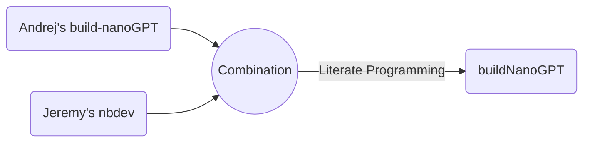

# buildNanoGPT


<!-- WARNING: THIS FILE WAS AUTOGENERATED! DO NOT EDIT! -->

> `buildNanoGPT` is developed based on Andrej Karpathy’s
> [build-nanoGPT](https://github.com/karpathy/build-nanoGPT) repo and
> [Let’s reproduce GPT-2
> (124M)](https://www.youtube.com/watch?v=l8pRSuU81PU) with added notes
> and details for teaching purposes using
> [nbdev](https://nbdev.fast.ai/), which enables package development,
> testing, documentation, and dissemination all in one place - Jupyter
> Notebook or Visual Studio Code Jupyter Notebook in my case 😄.

## Literate Programming

`buildNanoGPT`



`micrograd2023`


## Disclaimers

`buildNanoGPT` is written based on [Andrej
Karpathy](https://karpathy.ai/)’s github repo named
[build-nanoGPT](https://github.com/karpathy/makemore) and his [“Neural
Networks: Zero to
Hero”](https://www.youtube.com/playlist?list=PLAqhIrjkxbuWI23v9cThsA9GvCAUhRvKZ)
lecture series. Specifically the lecture called [Let’s reproduce GPT-2
(124M)](https://www.youtube.com/watch?v=l8pRSuU81PU).

Andrej is the man who needs no introduction in the field of Deep
Learning. He released a series of lectures called [Neural Network: Zero
to Hero](https://karpathy.ai/zero-to-hero.html), which I found extremely
educational and practical. I am reviewing the lectures and creating
notes for myself and for teaching purposes.

`buildNanoGPT` was written using [nbdev](https://nbdev.fast.ai/), which
was developed by [Jeremy Howard](https://jeremy.fast.ai/), the man who
also needs no introduction in the field of Deep Learning. Jeremy created
`fastai` Deep Learning software [library](https://docs.fast.ai/) and
[Courses](https://course.fast.ai/) that are extremely influential. I
highly recommend `fastai` if you are interested in starting your journey
and learning with ML and DL.

`nbdev` is a powerful tool that can be used to efficiently develop,
build, test, document, and distribute software packages all in one
place, Jupyter Notebook or Jupyter Notebooks in VS Code, which I am
using.

If you study lectures by Andrej and Jeremy you will probably notice that
they are both great educators and utilize both top-down and bottom-up
approaches in their teaching, but Andrej predominantly uses *bottom-up*
approach while Jeremy predominantly uses *top-down* one. I personally
fascinated by both educators and found values from both of them and hope
you are too!

## Usage

### Prepare FineWeb-Edu-10B data

``` python
from buildNanoGPT import data
import tiktoken
import numpy as np
```

``` python
enc = tiktoken.get_encoding("gpt2")
eot = enc._special_tokens['<|endoftext|>'] # end of text token
eot
```

    50256

``` python
t_ref = [eot]
t_ref.extend(enc.encode("Hello, world!"))
t_ref = np.array(t_ref).astype(np.uint16)
t_ref
```

    array([50256, 15496,    11,   995,     0], dtype=uint16)

``` python
t_ref = [eot]
t_ref.extend(enc.encode("Hello, world!"))
t_ref = np.array(t_ref).astype(np.int32)
t_ref
```

    array([50256, 15496,    11,   995,     0], dtype=int32)

``` python
doc = {"text":"Hello, world!"}
t_test = data.tokenize(doc)
t_test
```

    array([50256, 15496,    11,   995,     0], dtype=uint16)

``` python
assert np.all(t_ref == t_test)
```

``` python
# Download and Prepare the FineWeb-Edu-10B sample Data
data.edu_fineweb10B_prep(is_test=True)
```

    Resolving data files:   0%|          | 0/1630 [00:00<?, ?it/s]

    Loading dataset shards:   0%|          | 0/98 [00:00<?, ?it/s]

    'Hello from `prepare_edu_fineweb10B()`! if you want to download the dataset, set is_test=False and run again.'

### Prepare HellaSwag Evaluation data

``` python
data.hellaswag_val_prep(is_test=True)
```

    'Hello from `hellaswag_val_prep()`! if you want to download the dataset, set is_test=False and run again.'

### Load Pre-trained Weight

``` python
from buildNanoGPT.model import GPT, GPTConfig
from buildNanoGPT.train import DDPConfig, TrainingConfig, generate_text
import tiktoken
import torch
from torch.nn import functional as F
```

``` python
master_process = True
model = GPT.from_pretrained("gpt2", master_process)
```

    loading weights from pretrained gpt: gpt2

``` python
enc = tiktoken.get_encoding('gpt2')
```

``` python
ddp_cf = DDPConfig()
model.to(ddp_cf.device)
```

    using device: cuda

    GPT(
      (transformer): ModuleDict(
        (wte): Embedding(50257, 768)
        (wpe): Embedding(1024, 768)
        (h): ModuleList(
          (0-11): 12 x Block(
            (ln_1): LayerNorm((768,), eps=1e-05, elementwise_affine=True)
            (attn): CausalSelfAttention(
              (c_attn): Linear(in_features=768, out_features=2304, bias=True)
              (c_proj): Linear(in_features=768, out_features=768, bias=True)
            )
            (ln_2): LayerNorm((768,), eps=1e-05, elementwise_affine=True)
            (mlp): MLP(
              (c_fc): Linear(in_features=768, out_features=3072, bias=True)
              (gelu): GELU(approximate='tanh')
              (c_proj): Linear(in_features=3072, out_features=768, bias=True)
            )
          )
        )
        (ln_f): LayerNorm((768,), eps=1e-05, elementwise_affine=True)
      )
      (lm_head): Linear(in_features=768, out_features=50257, bias=False)
    )

``` python
generate_text(model, enc, ddp_cf)
```

    rank 0 sample 0: Hello, I'm a language model, and I do not want to use some third-party file manager I used on my laptop. It would probably be easier
    rank 0 sample 1: Hello, I'm a language model, not a problem solver. I should be writing. In the first book, I was in the trouble of proving that
    rank 0 sample 2: Hello, I'm a language model, not a script," he said.

    Banks and regulators will likely be wary of such a move, but for
    rank 0 sample 3: Hello, I'm a language model, you must understand this.

    So what really happened?

    This article would be too short and concise. That

### Training

1.  import modules and functions

``` python
# either running 03_train.ipynb or short-cut by running train script from the buildNanoGPT package
from buildNanoGPT.train import train_GPT, set_random_seed
from buildNanoGPT.model import GPT, GPTConfig, DataLoaderLite
from buildNanoGPT.train import DDPConfig, TrainingConfig, create_model
import torch
```

2.  set seed for random number generator for reproducibility

``` python
set_random_seed(seed=1337) # for reproducibility
```

3.  initiate DDP and Training configs - read the document and modify the
    config parameters as desired

``` python
ddp_cf = DDPConfig()
```

    using device: cuda

``` python
train_cf = TrainingConfig()
```

    using device: cuda

4.  setup train and validation dataloaders

``` python
train_loader = DataLoaderLite(B=train_cf.B, T=train_cf.T, ddp_cf=ddp_cf, split='train')
val_loader = DataLoaderLite(B=train_cf.B, T=train_cf.T, ddp_cf=ddp_cf, split="val")
```

    found 99 shards for split train
    found 1 shards for split val

5.  set up the GPT model

``` python
model = create_model(ddp_cf)
```

6.  train the GPT model

``` python
train_GPT(model, train_loader, val_loader, train_cf, ddp_cf)
```

    total desired batch size: 524288
    => calculated gradient accumulation steps: 32
    num decayed parameter tensors: 50, with 124,354,560 parameters
    num non-decayed parameter tensors: 98, with 121,344 parameters
    using fused AdamW: True
    validation loss: 10.9834
    HellaSwag accuracy: 2534/10042=0.2523
    step     0 | loss: 10.981724 | lr 6.0000e-05 | norm: 15.4339 | dt: 82819.52ms | tok/sec: 6330.49
    step     1 | loss: 10.157787 | lr 1.2000e-04 | norm: 6.5679 | dt: 10668.81ms | tok/sec: 49142.14
    step     2 | loss: 9.793260 | lr 1.8000e-04 | norm: 2.8270 | dt: 10747.73ms | tok/sec: 48781.28
    step     3 | loss: 9.575678 | lr 2.4000e-04 | norm: 2.2934 | dt: 10789.36ms | tok/sec: 48593.07
    step     4 | loss: 9.409717 | lr 3.0000e-04 | norm: 2.0182 | dt: 10883.30ms | tok/sec: 48173.61
    step     5 | loss: 9.196922 | lr 3.6000e-04 | norm: 2.0160 | dt: 10734.89ms | tok/sec: 48839.61
    step     6 | loss: 8.960140 | lr 4.2000e-04 | norm: 1.8684 | dt: 10902.57ms | tok/sec: 48088.46
    step     7 | loss: 8.707756 | lr 4.8000e-04 | norm: 1.5884 | dt: 10851.94ms | tok/sec: 48312.84
    step     8 | loss: 8.428266 | lr 5.4000e-04 | norm: 1.3737 | dt: 10883.36ms | tok/sec: 48173.34
    step     9 | loss: 8.166906 | lr 6.0000e-04 | norm: 1.1468 | dt: 10797.07ms | tok/sec: 48558.35
    step    10 | loss: 8.857561 | lr 6.0000e-04 | norm: 23.7457 | dt: 10755.35ms | tok/sec: 48746.74
    step    11 | loss: 7.858195 | lr 5.8679e-04 | norm: 0.8712 | dt: 10667.08ms | tok/sec: 49150.09
    step    12 | loss: 7.823021 | lr 5.4843e-04 | norm: 0.7075 | dt: 10793.02ms | tok/sec: 48576.59
    step    13 | loss: 7.755527 | lr 4.8870e-04 | norm: 0.6744 | dt: 10827.16ms | tok/sec: 48423.42
    step    14 | loss: 7.593850 | lr 4.1343e-04 | norm: 0.5836 | dt: 10730.71ms | tok/sec: 48858.64
    step    15 | loss: 7.618423 | lr 3.3000e-04 | norm: 0.6430 | dt: 10648.68ms | tok/sec: 49235.03
    step    16 | loss: 7.664069 | lr 2.4657e-04 | norm: 0.5456 | dt: 10749.31ms | tok/sec: 48774.10
    step    17 | loss: 7.603458 | lr 1.7130e-04 | norm: 0.6211 | dt: 10837.78ms | tok/sec: 48375.97
    step    18 | loss: 7.809735 | lr 1.1157e-04 | norm: 0.4929 | dt: 10698.80ms | tok/sec: 49004.37
    validation loss: 7.6044
    HellaSwag accuracy: 2448/10042=0.2438
    rank 0 sample 0: Hello, I'm a language model,:
     the on a a in is at on in� and are you in the to their for and in the a
    rank 0 sample 1: Hello, I'm a language model,� or an, and or and �, and you by are in
     to a of or. ( of the to
    rank 0 sample 2: Hello, I'm a language model,.
     or:
     the an-, withs,- and to the a.
    , who, and�
    rank 0 sample 3: Hello, I'm a language model, a by� to, for. that of they-, which are for and can- be.
     of:)
    step    19 | loss: 7.893970 | lr 7.3215e-05 | norm: 0.6688 | dt: 85602.68ms | tok/sec: 6124.67

### Visualize the Loss

``` python
from buildNanoGPT.viz import plot_log
```

``` python
plot_log(log_file='log/log_6500steps.txt', sz='124M')
```

    Min Train Loss: 2.997356
    Min Validation Loss: 3.275
    Max Hellaswag eval: 0.2782


## How to install

The [buildNanoGPT](https://pypi.org/project/buildNanoGPT/) package was
uploaded to [PyPI](https://pypi.org/) and can be easily installed using
the below command.

`pip install buildNanoGPT`

### Developer install

If you want to develop `buildNanoGPT` yourself, please use an editable
installation.

`git clone https://github.com/hdocmsu/buildNanoGPT.git`

`pip install -e "buildNanoGPT[dev]"`

You also need to use an editable installation of
[nbdev](https://github.com/fastai/nbdev),
[fastcore](https://github.com/fastai/fastcore), and
[execnb](https://github.com/fastai/execnb).

Happy Coding!!!

<div class="alert alert-info">

<b>Note:</b> `buildNanoGPT` is currently Work in Progress (WIP).

</div>
