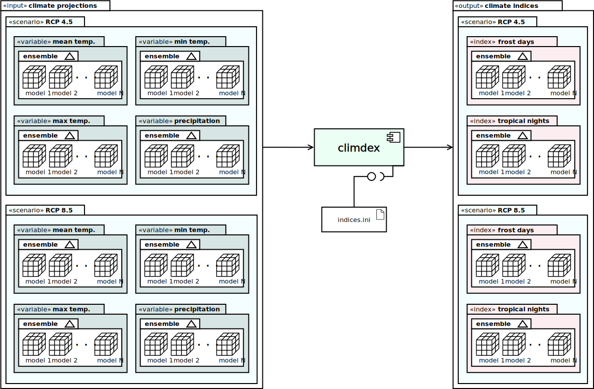

# `climdex-kit`: compute, publish, analyse

* [Background](#background)
* [Content](#content)
* [Technologies](#technologies)
* [Installation](#installation)
* [Usage](#usage)
* [Examples](#examples)

[](docs/uml/)

This project contains a Python package for the parallelized
local computation of [scenario](https://climatescenarios.org/primer/)-aware
climate indices starting from input time-series
of climate projections.

The package comes with an pre-compiled initial set of indices, mostly
relying on the [CDO](https://code.mpimet.mpg.de/projects/cdo) operators.
For the more advanced ones (SPI and SPEI), the [climate-indices](https://climate-indices.readthedocs.io)
Python package is used.
This set of indices can be easily customised or extended: please
check out [how to contribute](CONTRIBUTING.md) if you are interested.


## Background

A climate index is information derived from one or more climate variables
(precipitation, mean temperature, etc). The index can range from a simple
conditional counting of days against a threshold, to more complex
statistical processing.

The information is usually calculated spatially
on a pixel-by-pixel basis, with possibly some form of aggregation over time.
Hence the spatio-temporal domain of an index is generally a time-series
with the same spatial resolution, and with either the same or a coarser
temporal step.

The availability of robust and easily interpretable information about
the spatial distribution and temporal evolution of climate related-hazards,
especially climate extremes, is an increasing need not only for the
research community but also for a wide range of sectors and applications.

The European Environmental Agency has been currently supporting, in the
framework of the European Topic Centre on Climate Change impacts, vulnerability
and Adaptation (ETC-CCA), the review and selection of suitable climate-related
indices for Europe to be recommended and implemented for adaptation purposes.


## Content

The project is structured as follows:

* `src/` : source folder containing the Python package implementation
* `test/` : test suites
* `etc/` : folder with configuration files (most notably the **indices.ini**
           file with the definition of the climate indices
* `notebooks/` : folder with the Jupyter notebooks
* `docs/` : documentation folder
* `requirements.txt`/`environment.yml` : package dependencies for *pip*
   and *conda* environments
* `Makefile` : set of rules for building and installing the package
* `AUTHORS` : list of authors
* `CONTRIBUTING.md` : help for developers
* `CHANGELOG.md` : list of notable changes for each release of the project
* `README.md` : this file

The following files are required for packaging and distribution:

* `pyproject.toml` : tells what is required to build the project
* `setup.cfg`/`setup.py` : static/dynamic package metadata for **setuptools**

## Technologies

The package is written in Python and for most of the implemented climate indices
relies on both the [CDO](https://code.mpimet.mpg.de/projects/cdo/wiki/Cdo#Documentation)
library, and the [climate-indices](https://github.com/monocongo/climate_indices) package.


## Installation

The package is available as both *pip* sdist/wheel and *conda* package.

### Dependencies

The package relies on the
[CDO](https://code.mpimet.mpg.de/projects/cdo/wiki/Cdo#Installation-and-Supported-Platforms)
operators library v1.9.9. If you are using *conda* environments, you can install the package as follows:

```sh
conda install -c conda-forge cdo=1.9.9
```

In alternative, you can install the `climdex-kit` *conda* package as explained later in this file.

### Install from PyPI via pip

```sh
$ python3 -m pip install climdex-kit
```

### Install as conda package

```sh
TODO
```

### Install in development mode

For developers: refer to the instructions in the [CONTRIBUTING](CONTRIBUTING.md)
file for the setup of the development environment instead.

## Usage

The `climdex` Python package provides a set sub-commands for the specific actions to be taken

* `list`/`ls` : list all available indices
* `show`/`sh` : show the details of a specific index
* `compute`/`co` : compute one or more indices

There is thus a hierarchical organization of the CLI arguments.
At any level of the hierarchy, the `--help`/`-h` option can be called to print
the help message.

### general args

| <div style="width:30%">option</div> | <div style="width:60%">description</div> | allowed values |
|:------------------------------------|:-----------------------------------------|:--------------:|
| `--version`            | Get the version number of the program | |
| `--idx-conf`/`-c` FILE | Alternative indices configuration file (.ini) (default is ./etc/indices.ini) | abs/rel path |
| `--log-conf`/`-L` FILE | Alternative logging configuration file (.yaml) (default: ./etc/logging.yml)  | abs/rel path |
| `-d`                   | Enable debug mode | |

(See `$ python -m climdex -h` for a full synopsis)


### {list,ls} args

This sub-command currently does not provide any option.
Run `$ python -m climdex list` to get a summary of all available climate indices.


### {show,sh} args

| <div style="width:30%">option</div> | <div style="width:60%">description</div> | allowed values |
|:------------------------------------|:-----------------------------------------|:--------------:|
| `index` | the index configuration to be visualized | see `{list,ls}` sub-command | 

(See `$ python -m climdex show -h` for a full synopsis)


### {compute,co} args

| <div style="width:30%">option</div> | <div style="width:60%">description</div> | allowed values |
|:------------------------------------|:-----------------------------------------|:--------------:|
| `--index` / `-i` INDEX | A comma-separated list of indices to be computes | see `{list,ls}` sub-command | 
| `--multiprocessing`    | The CPU parallelism to be employed | int>0 (N of CPUs) or one among {`one`, `all_but_one`, `all`} |
| `--idir` DIR           | Root folder where to look for input files (expected structure: *$input_dir/variable/scenario/\*.nc*) | abs/rel path |
| `--odir`/`-o` DIR      | Root folder where to store indices files | abs/rel path |
| `--scenario`/`-s` S    | White-space separated list of scenarios | sub-folders of input variables |
| `--regex`/`-x` R       | Filter input files with a regular expression | regex |
| `--metadata-only`/`-m` | Only re-set the output attributes (metadata) on existing indices files (compute the index file too on non-existing file instead) | |
| `--dry-run`/`-n`       | Only print jobs to output without doing anything | |
| `--force`/`-f`         | Force overwrite of existing output indices files (otherwise execution is stopped) | |

(See `$ python -m climdex compute -h` for a full synopsis)


### Data organization

The package expects a fixed organization of the input datasets and a fixed naming scheme
in order to properly extract all the metadata.

The path and name of a climate projection NetCDF starting from the $IDIR input
root directory (`--idir` in the command line) shall be as follows:

```sh
$IDIR/{var}/{scenario}/{var}_{model}_{timeres}_{yearstart}{yearend}_{scenario}.nc
```

Being:

* `{var}` : the climate variable (whose label shall also coincide with the name of the
variable in the NetCDF)
* `{scenario}` : the name of the emissions scenario
* `{model}` : the name of the climate model used to create the projection
* `timeres` : the time-step of the time-series (e.g. day, month, etc)
* `yearstart` / `yearend` : time range of the time-series (`YYYY` format)

For ancillary scenario-independent datasets (e.g. land mask),
the `{scenario}/` sub-folder can be omitted mandatory, and the name
of the dataset shall be `{var}.nc`.

Analogously, given the $ODIR output specified via `--odir/-o` CLI argument, 
each index file will be stored then as follows:

```sh
$ODIR/{index}/{scenario}/{index}_{model}_{timeres}_{yearstart}{yearend}_{scenario}.nc
``` 

### Logging

By default the program logs to both console (with colored output to highlight warnings and errors),
and to a file called `climdex.log` in the current working directory.

The configuration of both loggers can be found in `./etc/logging.yaml`, otherwise use
the `--log-conf`/`-L` option to set an alternative configuration.


## Examples

```sh
# list all avaiable indices
$ python -m climdex list

# show the configuration details of the index [spei12]
$ python -m climdex show spei12

# compute the frost days [fd] and 12-months SPI [spi12] index on all available climate
#   projections for scenario rcp85 and by using 3 CPUs
$ python -m climdex \ 
    compute \
    --index amt,spi12   \
    --multiprocessing 3 \
    --scenario rcp85    \
    --idir $IDIR        \
    --odir $ODIR

# update the metadata of all existing indexes of scenario rcp85, and compute the missing ones anew
#   using all CPUs + turn on debug mode + dry run only
$ python -m climdex -d \ 
    compute \
    --index all           \
    --scenario rcp85      \
    --multiprocessing all \
    --metadata-only       \
    --idir $IDIR          \
    --odir $ODIR          \
    --dry-run

# re-compute the [fd] and [tn] indices for the model "EUR-11_CNRM-CERFACS-CNRM-CM5_CLMcom-CCLM4-8-17_r1i1p1_v1"
#   and scenario rcp45 and keep it on a separate file for comparison with existing
#   + use 1 CPU (sequential execution)
$ python -m climdex \ 
    compute \
    --index fd,tn         \
    --scenario rcp45      \
    --multiprocessing one \
    --idir $IDIR          \
    --odir $ODIR          \
    --regex "*EUR-11_CNRM-CERFACS-CNRM-CM5_CLMcom-CCLM4-8-17_r1i1p1_v1*"
 
# re-compute (and overwrite when existing) all indexes on rcp45 and rcp85 scenarios
#   + using all available CPUs except one
$ python -m climdex \ 
    compute \
    --index all                   \
    --scenario rcp45 rcp85        \
    --multiprocessing all_but_one \
    --idir $IDIR                  \
    --odir $ODIR                  \
    --force
```

## Credits
This project is funded by the
[FAct CLIMAX](https://www.eurac.edu/en/institutes-centers/institute-for-earth-observation/projects/fact-climax)
project at Eurac Research (Institute for Earth Observation).

[](https://www.eurac.edu/en/institutes-centers/institute-for-earth-observation)

