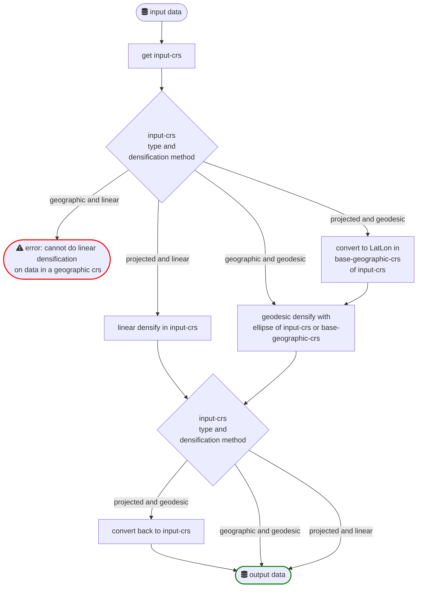

# DOCS

## Densify command

See the following flowchart for a highlevel schematic overview of the `densify` functionality of `geodense`:

```mermaid
flowchart
    input([fa:fa-database input data]) --> p_1[get input-crs]
    p_1 --> d_1{input-crs<br>type and<br>densification method}
    d_1 -->|geographic and linear| output_error([fa:fa-exclamation-triangle error: cannot do linear densification<br> on data in a geographic crs])
    d_1 -->|geographic and geodesic| p_3
    d_1 -->|projected and linear| p_4[linear densify in input-crs]
    d_1 -->|projected and geodesic| p_2    
    p_4-->d_4
    p_3["geodesic densify with<br>ellipse of input-crs or base-geographic-crs"]
    p_2[convert to LatLon in<br>base-geographic-crs<br> of input-crs]
    p_2 --> p_3
    p_3-->d_4{input-crs<br>type and<br>densification method}
    d_4 -->|projected and geodesic| p_5[convert back to input-crs]
    p_5 -->output
    d_4 -->|geographic and geodesic| output([fa:fa-database output data])
    d_4 -->|projected and linear| output
    style output_error stroke: red,stroke-width:2px
    style output stroke: green,stroke-width:2px
```
