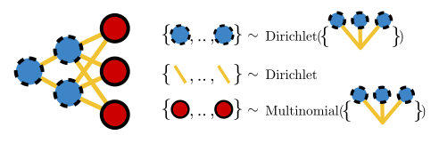

# Deep Bayesian unsupervised clustering

This repository contains deep Bayesian unsupervised clustering models. In particular,
the multinomial belief network [1] and Zhou–Cong–Chen's Poisson gamma belief network [2].

## Installation
You can pip install this package by running:
```bash
pip3 install mubelnet
```

## Quick start guide

Let's create a two-layer multinomial belief network (like in the figure) with one and two hidden units, respectively. The kernel function, that advances the Markov chain by a single (Gibbs) step looks as follows:
```python
import haiku as hk
import jax
from mubelnet.nets import MultinomialBelief
from mubelnet.mcmc import sample_markov_chain

# Set up training data.
X_train = ...
n_features = X_train.shape[1]

@hk.transform_with_state
def kernel():
    """Advance Markov chain of belief net by one step."""
    n_hidden_units = (1, 2)
    model = MultinomialBelief(n_hidden_units, n_features)
    model(X_train)  # Do one Gibbs sampling step.

params, trace = sample_markov_chain(
    jax.random.key(42),
    kernel=kernel,
    n_samples=100,
    n_chains=2,
    n_burnin_steps=100,
)
```

## Documentation
Reference docs can be found on: https://hylkedonker.gitlab.io/mubelnet.

## Example handwritten digits
A more complete example, that shows how to train a network on the UCI ML hand-written digits datasets, see the [digits jupyter notebook](examples/digits.ipynb).

## Meta-mutational signatures
You can browse the meta-mutational signatures (based on COSMIC v3.3)  ]and their tri-nucleotide spectra in the [meta-signature overview](examples/mutational-signatures/README.md).

### Download
The weights of the meta-signatures and the hyperparameters are available in comma-separated format:
- [meta_signatures.csv](examples/mutational-signatures/meta_signatures.csv)
- [hyperparam_c.csv](examples/mutational-signatures/hyperparam_c.csv)
- [hyperparam_r.csv](examples/mutational-signatures/hyperparam_r.csv)


## References
[1] Donker _et al_. "[Multinomial belief networks for healthcare data](https://arxiv.org/abs/2311.16909)", Proceedings of Machine Learning Research 25:1–22, 2024 (2024).

[2]: Zhou, Cong, Chen. "[Augmentable gamma belief networks.](https://www.jmlr.org/papers/volume17/15-633/15-633.pdf)", J. Mach. Learn. Res. 17.1, 5656-5699 (2016).

## License
The code open sourced under the MIT license (see [LICENSE.txt](LICENSE.txt)).
