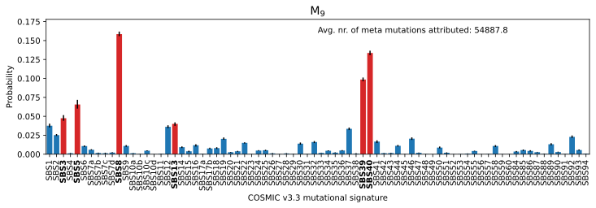
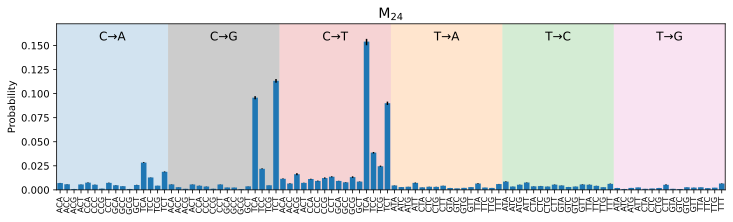
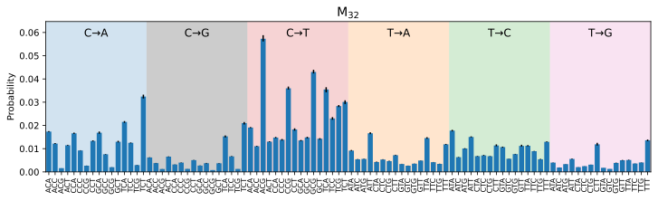

# Meta-signatures single base substitutions
Meta-mutational signatures, or meta-signatures for short, are signatures of signatures. That is, they describe mutational signatures that typically go together in a sample. Those reported below are based on the COSMIC v3.3 single base substitution signatures and are inferred using the multinomial belief network.

## $M_1$
$M_1$ describes primarily the co-occurrence of replicative DNA polymerase ε damage (SBS10a, SBS10b, and SBS28) with mismatchrepair deficiency (SBS15 and SSB21).

## $M_2$
Meta-signature $M_2$ primarily captures, presumably, oxidative stress. Both SBS17a/b and SBS18 are thought to be related to DNA oxidation of guanine leading to 8-Oxo-2’-deoxyguanosine; SBS18 is
additionally linked to hydroxyl radicals in culture. Similar
to clock-like signature SBS1 (describing spontaneous deamination of 5-methylcytosine), damage due to 8-oxodG accumulates in the course of life. To a lesser extent, $M_2$ also captures SBS8, which is believed to
be (uncorrected) replication errors.

## $M_3$
Meta-signature $M_3$ describes signatures with a strong transcriptional strand bias (SBS5, SBS8, SBS12, SBS16, SBS92, and SBS22) with the exception of SBS40. Its primary constituent SBS12 is believed to be related to transcription-coupled nucleotide excision repair. The
second largest contributor, SBS40, is a spectrally flat, latereplicating, signature with spectral similarities to SBS5
(both are related to age) and is believed to be linked
to SBS8. According to COSMIC, some contamination
between SBS5 and SBS16 may be present; $M_3$ is
consistent with this observation. Finally, $M_3$ also captures the
co-occurrence with SBS22, which is canonically attributed to
aristolochic acid exposure.

## $M_4$
$M_4$ describes the co-occurrence of several, seemingly disparate, mutational signatures of known and unknown aetiology. Of known cause are, SBS7b, linked to ultraviolet light (catalysing cyclobutane pyrimidine dimer formation), SBS87 to thiopurine chemotherapy exposure (although its presence has been reported in a thiopurine-naive lung cancer population) and SBS88, related to colibactin-induced damage from the Escherichia
coli bacterium (found in mouth cancer and in
normal and cancerous colon tissue). Concurrently,
$M_4$ comprises SBS12, SBS23, SBS37, SBS39 and SBS94, all of unknown cause.

## Remaining meta signatures $M_5$ - $M_{41}$
For completeness, we list all 37 other meta signatures. Those reported below are the remaining meta-signatures with a non-zero activity, but where the Jensen-Shannon distance fell below 0.25 for at least one signature. Beware, while
completely inactive meta signatures were pruned, some remained with a very small topic activity throughout the dataset (to
wit, $M_{23}$, $M_{26}$, $M_{35}$, $M_{37}$ - $M_{40}$).

