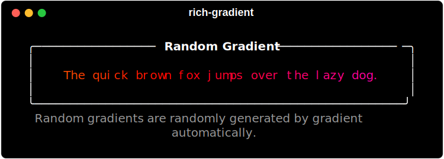
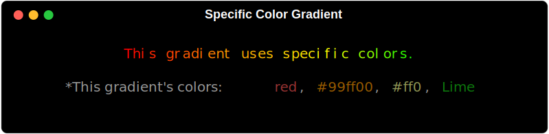

# Gradient

The `Gradient` class is a subclass of `Text` that allows you to create gradients of color in your text. You can just enter text and allow rich-gradient to generate a random gradient of color for you text,specify the colors you want to use, or generate a random rainbow gradient.

## Random Gradient
    
```python
    from rich import Console
    from rich_gradient import Gradient

    console = Console()
    console.print(
        Gradient(
            "The quick brown fox jumps over the lazy dog."
        )
    )
```



## Specific Color Gradient


You can specify the colors you want to use in your gradient by passing a list of color names, hex color codes, rgb color codes, or [`rich_gradient.color.Color`](color.md)  to the `colors` parameter.

```python
    console.print(
        Gradient(
            "This a gradient with specific colors.",
            colors=["red", "#ff9900", "#ff0", "Lime"],
            justify="center"
        )
    )
```

